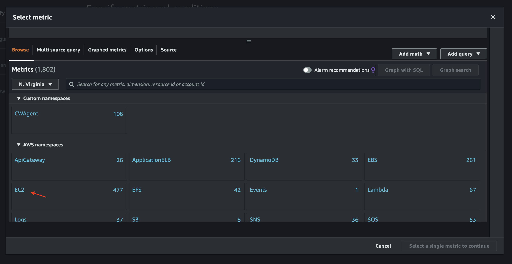
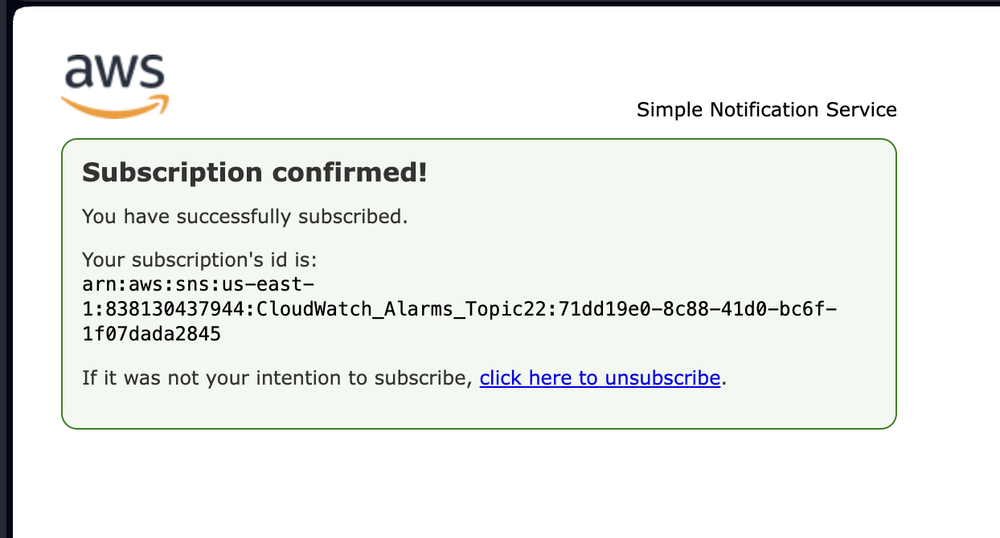

# CloudWatch Alarms for EC2 Instance Monitoring

  CloudWatch Alarms for EC2 Instance monitoring (Disk_Used_percent and CPU_Utilization)

  

  This project demonstrates the creation of CloudWatch alarms for monitoring an EC2 instance's disk_usage_percent and CPU Utilization on AWS. 

  These alarms notify you when predefined thresholds are breached, enabling proactive monitoring and potential issue identification.

# Setup Instructions

# 1. Create IAM Role for EC2:

  Create an IAM role with appropriate permissions for EC2 instances to publish metrics to CloudWatch.

  Select trusted entity and Use Cae
  
  

  Add Permissions and Search for CloudWatchAgentServerPolicy
  
  

  Enter Role Name and Create Role
  
 #  

# 2. Launch EC2 Instance:

  Launch an EC2 instance that necessitates monitoring. 

  

  
  **Add IAM Role**

   Select instance to Modify IA Role.
   
  

  Modify IAM Role and Update IAM Role
  

  select Instance and connect
  
  

  Connect Instance using EC2 Instance Connect
  
  # 

  
# 3. Install CloudWatch Agent:

  Follow the documentation to install the CloudWatch agent on the EC2 instance.

   Run the foloowing for Current Directory cd /tmp 

   Install Agent wget https://s3.amazonaws.com/amazoncloudwatch-agent/amazon_linux/amd64/latest/amazon-cloudwatch-agent.rpm

   update agent sudo rpm -U amazon-cloudwatch-agent.rpm
   
  

  
  Run the follwing comand below and input the script provided to create configuration file.
  
  sudo vi /opt/aws/amazon-cloudwatch-agent/etc/amazon-cloudwatch-agent.json
  
  i=edit, esc=done, :wq=exit
  
  

  
  Start your cloudwatch Agent and confirm the confirguration. using the linux command 

  sudo systemctl restart amazon-cloudwatch-agent
  
  tail -f /opt/aws/amazon-cloudwatch-agent/logs/amazon-cloudwatch-agent.log

  # 

# 4. Configure CloudWatch Alarms:

  Configure CloudWatch alarms to monitor specific metrics such as disk usage percentage and CPU utilization of the EC2 instance.

  Define suitable thresholds and associated actions to be triggered when metrics exceed the thresholds.

  select all Alarms and create alarm
  
  

  Select Metrics and next
  
  

  select dsik_Used_percent form metrics
  
  

  Configure metrics and select next
  
  

  Notification: Create sns topic and provide email. select  Next
  
  

  Add name and discription to alarm
  
  

  Review and create alarm
  
  

  Cloudwatch alarm created and eneabled.
  
  

  Disk_Used_percent alarm
  

  # for CPU Utilization
  
  Repeat thesame process for Disk_Used_percent

  Navigate to Ec2 on All metric in cloudwatch and select Ec2
  
  

  Select Per-Instance Metrics
  
  

  Select CPU utilization from list
  select metrics
  
  

  Specify metrics and Condtions. select Next
  
  
  
  EC2 CPU Utilization Alarm
   
  

   Disk_Used_percent and EC2 CPU Utilizations Alarm
  

# 5. Create SNS Topic:

Create an SNS topic to serve as the endpoint for notifications/alerts generated by CloudWatch alarms.

repeat this process for EC2 CPU utilization

confrim susbscritpion on email and repeart this process for the second alarm

